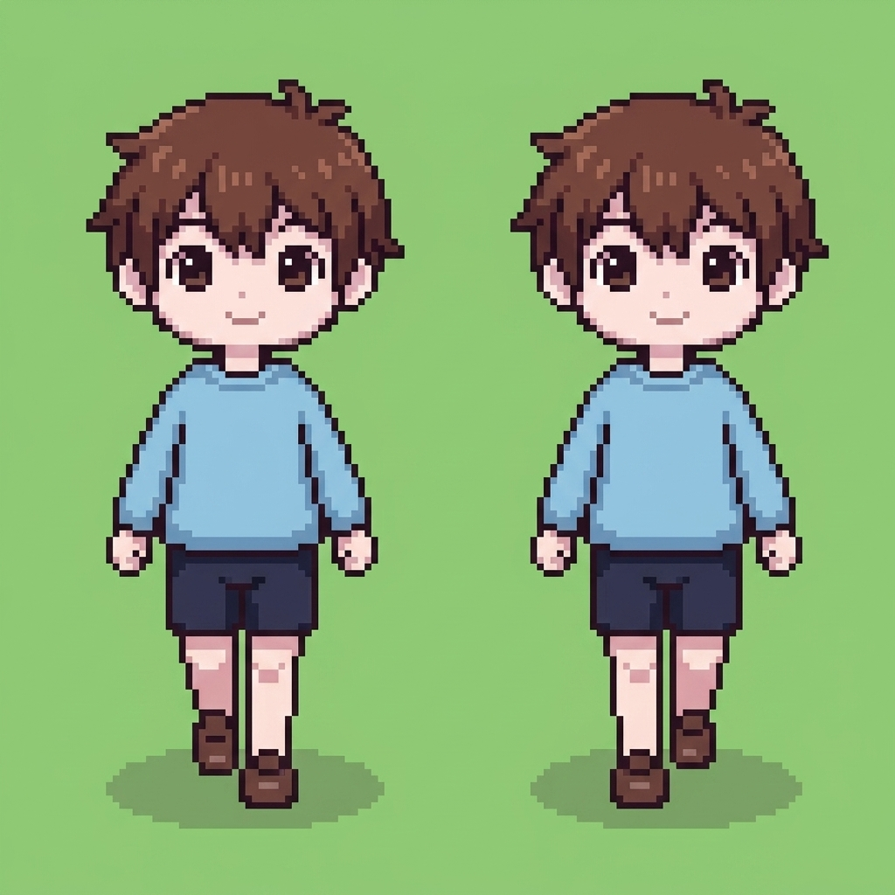
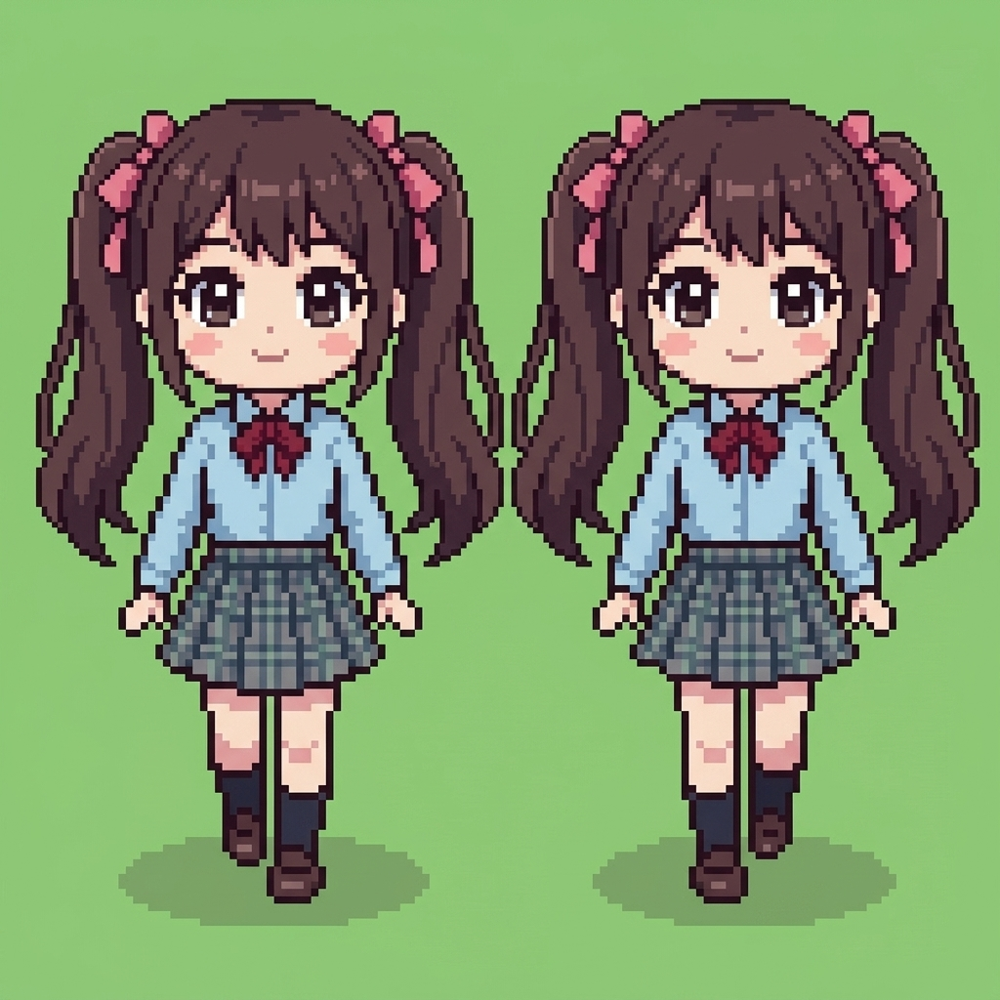
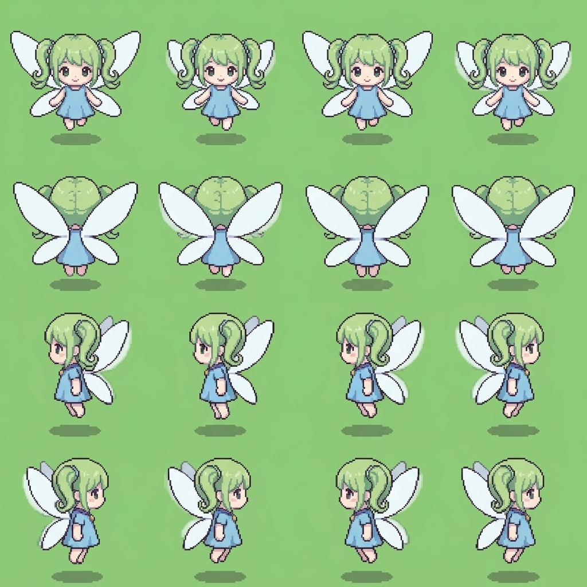
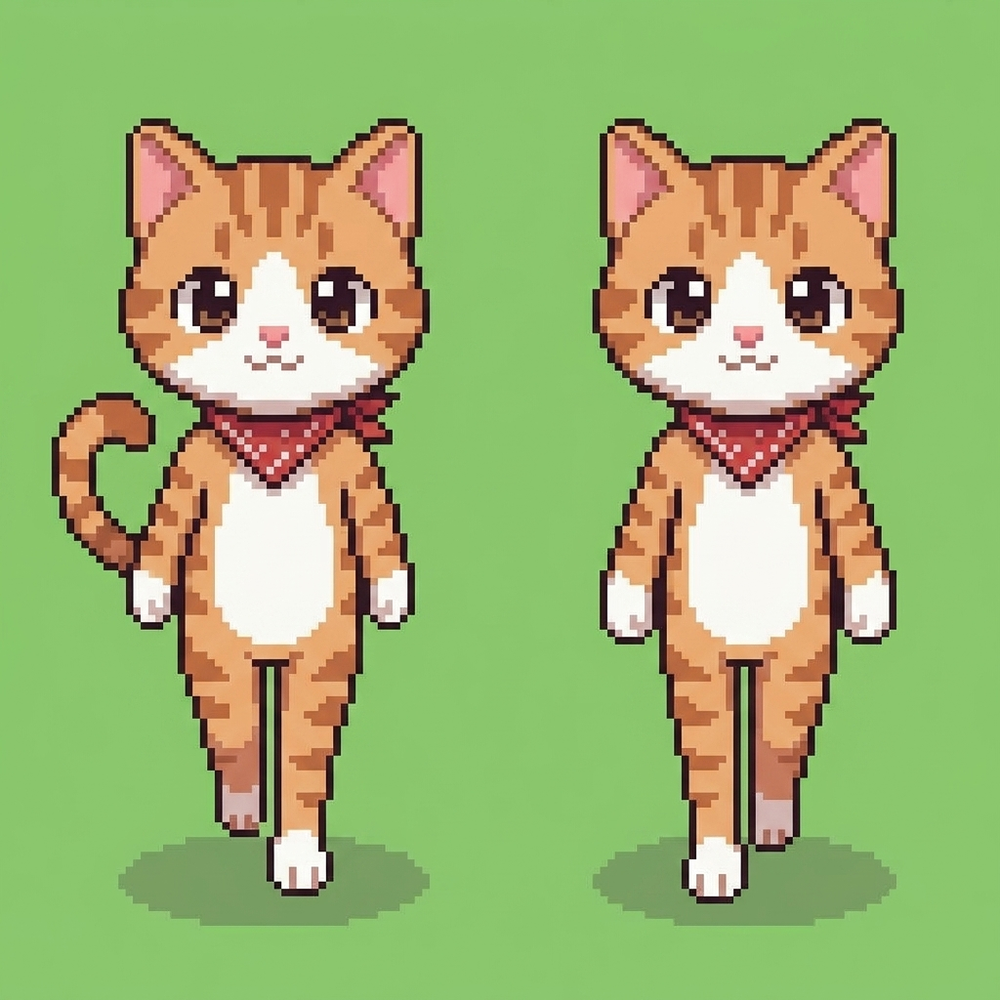
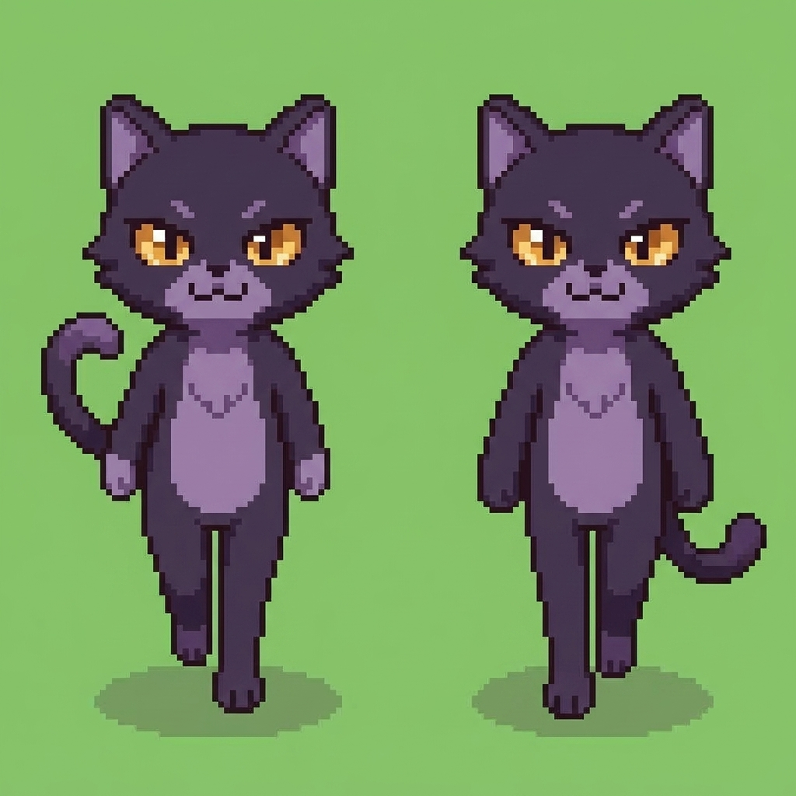
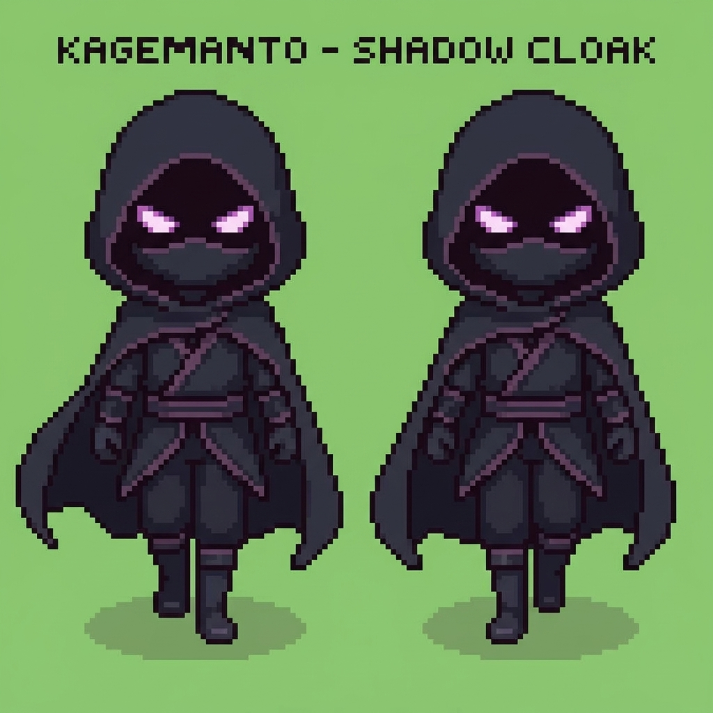
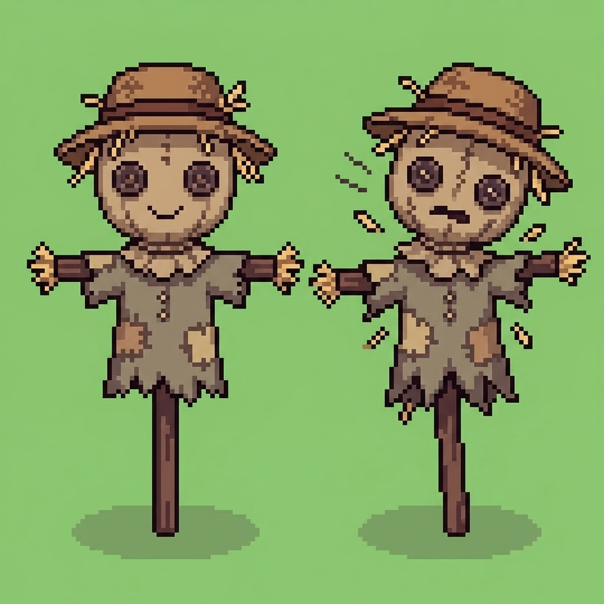
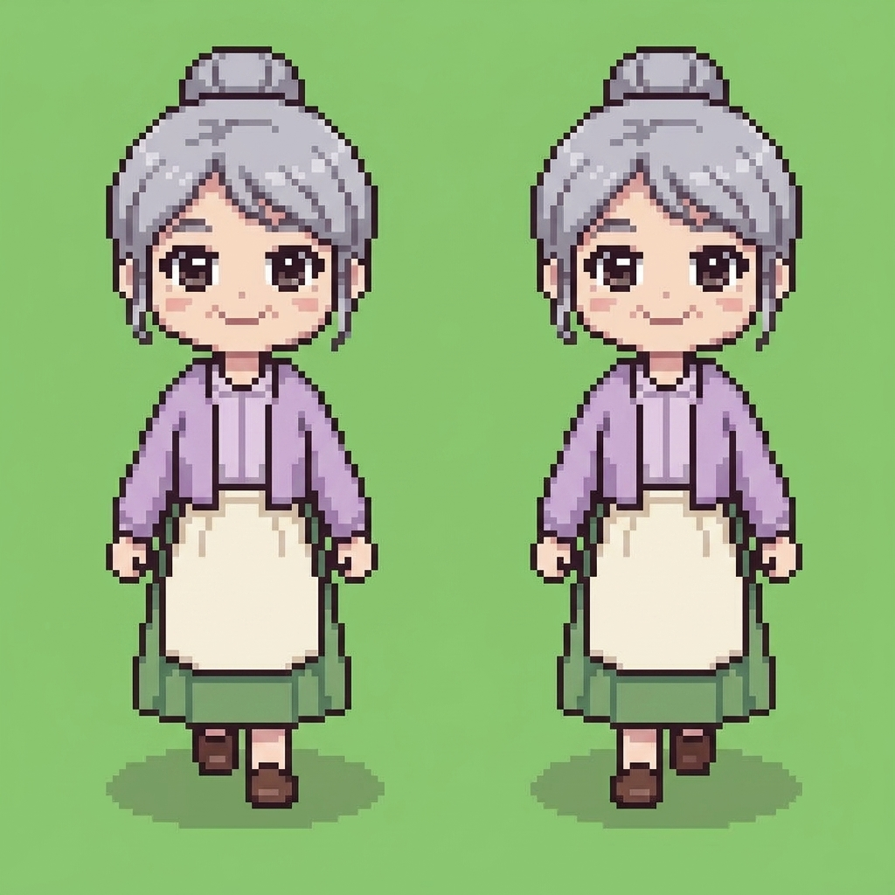
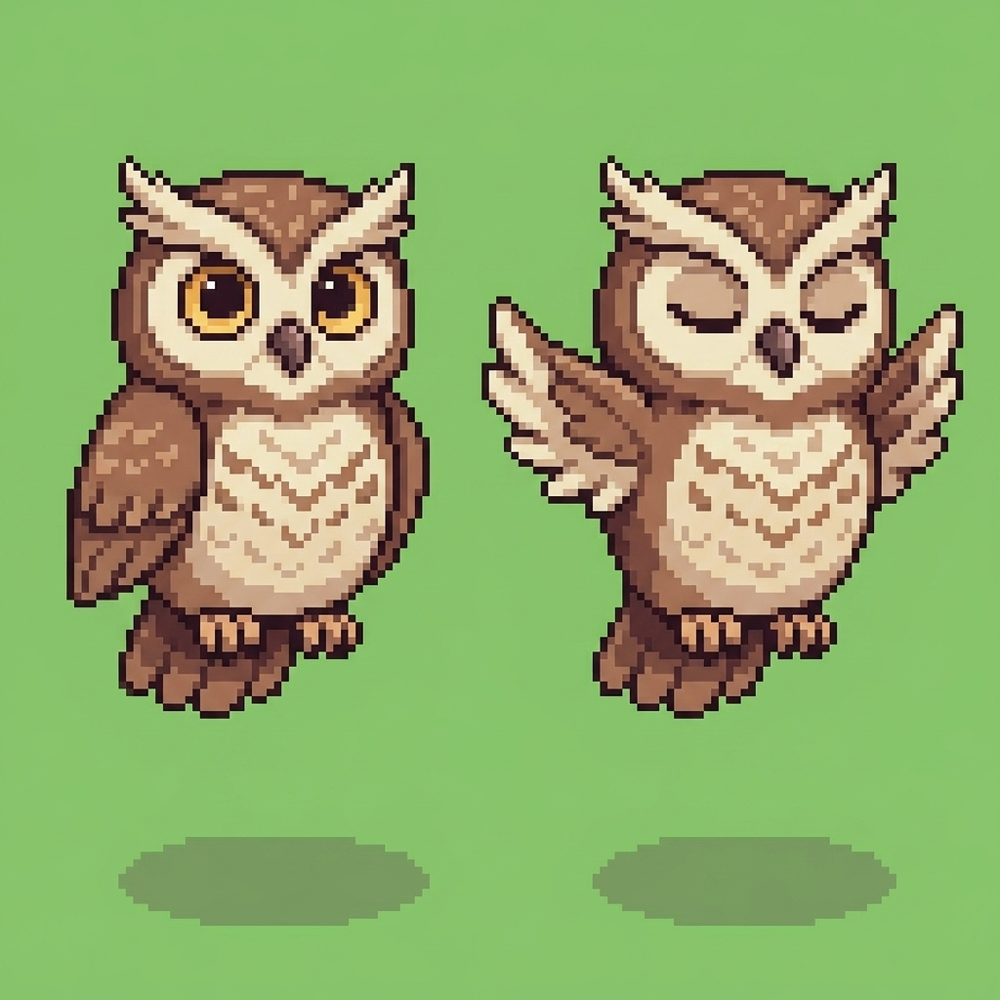
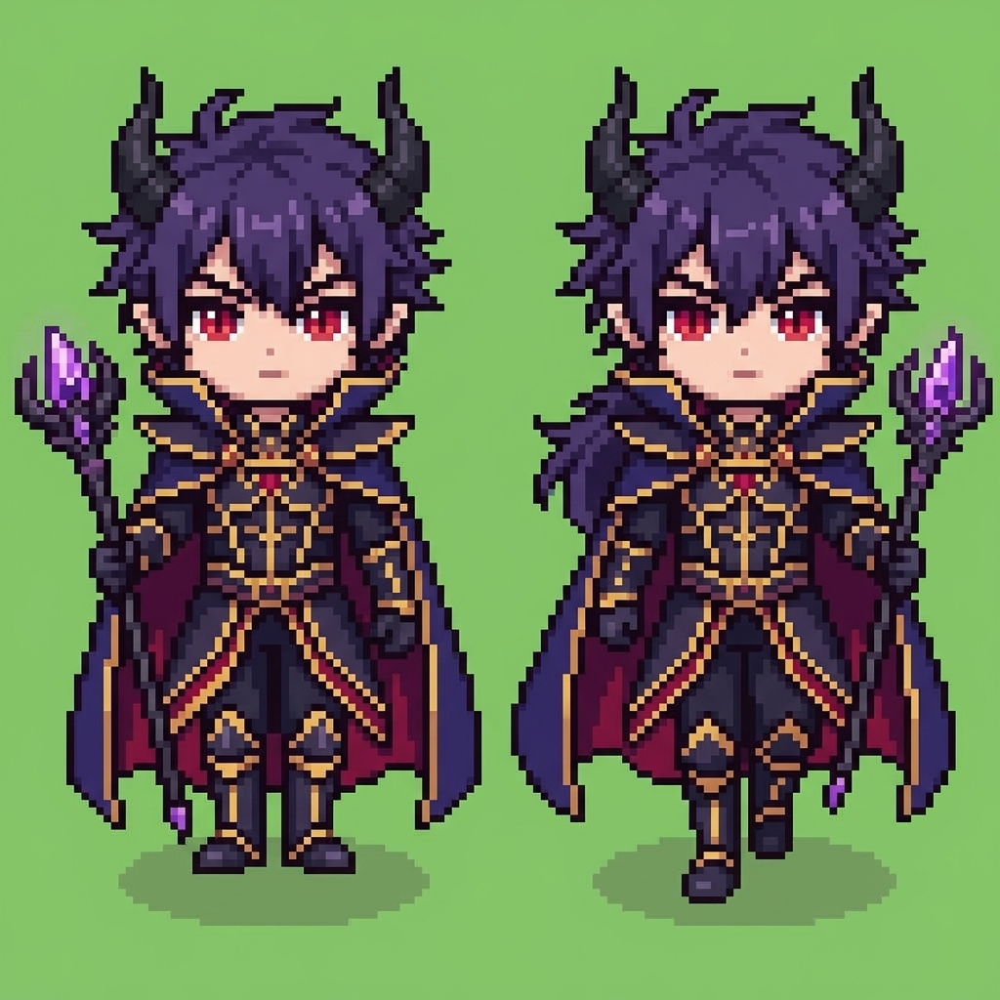

# ゲームキャラクター ドット絵スプライト集（決定版）

頭身、スケール感、歩行モーション、キャラクターデザインを完全に揃えたドット絵スプライト集です。

---

## 1. 狩人見習い ギル（歩行 2コマ）

森の入口でパトロールをしている元気ですばしこい少年。森で黒いマントのやつを目撃し、リイコに抜け道のヒントを教えてくれます。

---

## 2. 情報屋 セーラ（歩行 2コマ）

森の三叉路の東で状況を観察している、優しく運動も勉強もすべて優秀な美人。論理的な観察眼で正しい道のアドバイスをくれます。

---

## 3. 妖精 ベル（仲間1・4方向飛行スプライトシート）

もともと敵（やみのしろ一味）の下っ端だったが、裏切られて逃げ出す途中で蜘蛛の巣に引っかかった小悪魔な妖精。リイコに助けられ、復讐とお城の道案内を兼ねて仲間になります。

- 1行目: 下（正面向き浮遊）
- 2行目: 上（背面向き浮遊）
- 3行目: 左向き浮遊
- 4行目: 右向き浮遊

---

## 4. 仲間ねこ ミィ（仲間2・歩行 2コマ）

主人公リイコの相棒猫。3面で合流し、指示を出して戦う頼れるパートナー。茶トラ白、赤いバンダナ、大きな丸い瞳。

---

## 5. 敵ネコ いたずらネコ（歩行 2コマ）

森や谷で登場する敵ネコ。琥珀色の瞳とダークパープルの毛並み、キリッとした表情の歩行2コマです。

---

## 6. かげマント（歩行 2コマ）

ハナをさらって逃げる手下。黒いフードとマント、影から光る紫の瞳、忍び装束の怪盗風キャラクターです。

---

## 7. かかし（練習台 2コマ）

村にある剣の練習台。麦わら帽子と麻袋の顔、通常立ちポーズと斬られたときのリアクションポーズです。

---

## 8. スミレばあちゃん（歩行 2コマ）

村の優しいおばあさん。銀髪のお団子ヘア、薄紫のカーディガンとエプロン姿です。

---

## 9. ふくろうのホゥ（2コマ）

見晴らしの高台でやみのしろを教えてくれる知恵者のふくろう。止まり木ポーズと羽ばたきポーズです。

---

## 10. やみのまおう（歩行 2コマ）

4面のラスボス。小さな角、紅い瞳、暗黒のマントと王衣、魔法の杖を持ったダークファンタジーの魔王です。

